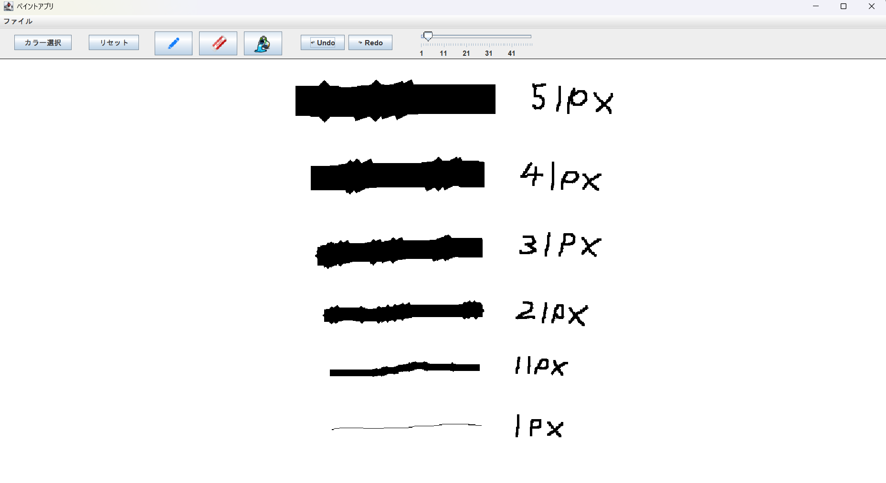

# 🎨 ペイントアプリ
Java Swingを使ったシンプルなペイントアプリです。

手描きの線を描画したり、消しゴムで消すことはもちろん、塗りつぶしも可能です。




## 📌 主な機能
-  **自由にお絵描き**
-  **筆の太さ変更可能**
-  **消しゴムモード**
-  **塗りつぶし機能**
-  **画像の読み込み・保存**
-  **Undo / Redo**
-  **リセットボタンでキャンバスをクリア**

## 🛠️ 動作環境
- **JDK:** Java 23 (Java 11以上)
- **GUI:** Java Swing

## 💻 実行方法
1. **Javaをインストール**

   Java Development Kit(JDK)をインストールしてください。　(最新版のJDKを推奨)

2. **リポジトリのクローン(ダウンロード)**

   ターミナルまたはコマンドプロンプトで以下を実行:
   ```sh
   git clone https://github.com/motomasMINO/PaintApp-Java.git
   
   cd PaintApp-Java
   ```

3. **アプリ起動**
   ```sh
   java -cp src App
   ```

## 📜 ライセンス
このプロジェクトはMIT Licenseのもとで公開されています。

## 📧 お問い合わせ
- **Github: motomasMINO**

- **Email: yu120615@gmail.com**

  バグ報告や改善点・機能追加の提案はPull RequestまたはIssueで受け付けています!